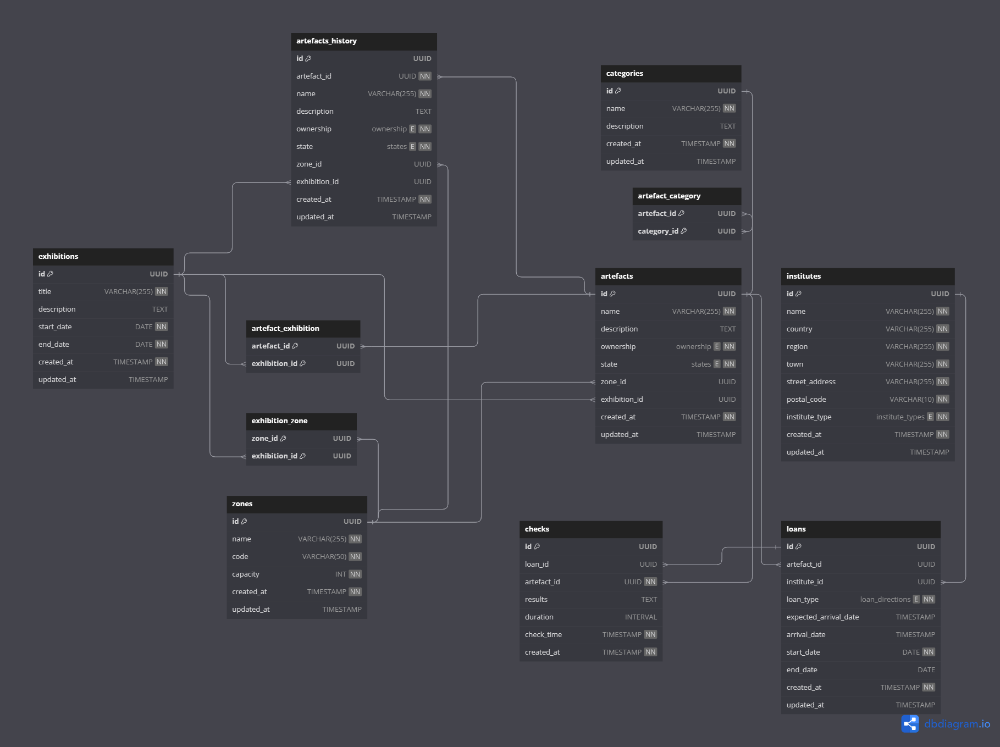

# DBS - Zadanie 5
**Adam Candrák**
FIIT STU

## Obsah
<!-- TOC -->
* [DBS - Zadanie 5](#dbs---zadanie-5)
  * [Obsah](#obsah)
  * [Diagram](#diagram)
  * [Zmeny od zadania 4](#zmeny-od-zadania-4)
  * [Popis Funkcií](#popis-funkcií)
  * [With Triggers](#with-triggers)
    * ['artefact_exclusivity'](#artefact_exclusivity)
    * ['check_zone_capacity'](#check_zone_capacity)
    * ['correct_date_order'](#correct_date_order)
    * ['log_artefact_changes'](#log_artefact_changes)
    * ['update_updated_at'](#update_updated_at)
    * ['zone_exclusivity'](#zone_exclusivity)
  * [Without Triggers](#without-triggers)
    * ['artefact_arrival'](#artefact_arrival)
      * [Parametre](#parametre)
    * ['check_artefact_zone'](#check_artefact_zone)
      * [Parametre](#parametre-1)
    * ['get_correct_artefact_zone'](#get_correct_artefact_zone)
      * [Parametre](#parametre-2)
  * [Procedures](#procedures)
    * ['update_current_exhibition'](#update_current_exhibition)
      * [Parametre](#parametre-3)
    * ['loan_foreign_artefact'](#loan_foreign_artefact)
      * [Parametre](#parametre-4)
    * ['loan_our_artefact'](#loan_our_artefact)
      * [Parametre](#parametre-5)
    * ['create_exhibition'](#create_exhibition)
      * [Parametre](#parametre-6)
  * [Procesy](#procesy)
    * [Naplánovanie expozície (exhibície)](#naplánovanie-expozície-exhibície)
    * [Vkladanie nového exempláru (artefaktu)](#vkladanie-nového-exempláru-artefaktu)
    * [Presun exempláru (artefaktu) do inej zóny](#presun-exempláru-artefaktu-do-inej-zóny)
    * [Prevzatie exempláru (artefaktu) z inej inštitúcie](#prevzatie-exempláru-artefaktu-z-inej-inštitúcie)
    * [Zapožičanie exempláru (artefaktu) z inej inštitúcie](#zapožičanie-exempláru-artefaktu-z-inej-inštitúcie)
  * [Ohraničenia](#ohraničenia)
<!-- TOC -->

## Diagram


## Zmeny od zadania 4
- Zmeny názvov tabuliek do plurálu a zjednotenie štýlu
- Vymazanie `Ended_exhibitions`
- Pridanie nových ENUM typov 
  - `status` použitý v `artefacts`
  - `ownership` použitý v `artefacts`
  - `institute_types` použitý v `institutes`
  - `loan_types` použitý v `loans`
- v tabulke `artefacts`, zmena názvu stľpca `condition` -> `state`
- Skrátenie názvov stĺpcov a tabuľky `foreign_institute` -> `institutes`
- Zmena názvu tabuľky `control` -> `checks`
  - a zmena typu `duration` INT -> INTERVAL
- `loan_id` v tabuľke `check` je nullable v prípade že by sme chceli kontroli na vlastných exemplároch
  - pridanie `artefact_id` pre lepšiu identifikáciu artefaktu
- v `institutes` rozdelenie `address` na viacero stĺpcov

## Popis Funkcií

## With Triggers

### 'artefact_exclusivity'
Zabraňuje vytváraniu exhibícií, ktoré by obsahovali artefakty, ktoré sú v zadanom časovom úseku inej exhibície.

### 'check_zone_capacity'
Kontroluje kapacitu zóny pri update `zone_id` v artefaktoch. Kontrola prebieha spočítaním výskytov danej ID v artefaktoch a porovnaním s kapacitou zóny.

### 'correct_date_order'
Kontroluje pridávanie dátumov do `exhibitions` a `loans` tabuliek. Kontroluje, či dátumy sú v správnom poradí (start < end).

### 'log_artefact_changes'
Loguje zmeny v artefaktoch. Pri zmene exhibition_id, zone_id, stavu alebo vlastníctva sa vytvorí nový riadok v tabuľke `artefact_history`, ktorý odkazuje na aktuálny stav artefaktu pomocou `artefact_id`.

### 'update_updated_at'
Tato komicky nazvaná funkcia slúži na aktualizáciu `updated_at` v každej tabuľke ktorá má `updated_at` (pri niektorých tabulkách ako hsitórií mi `updated_at` nedávalo význam). Pri zmene akehokolvek stľpca sa aktualizuje `updated_at`.
Pri hľadaní tabuliek, ktoré obsahujú `updated_at` sa používa pg_tables a information_schema.columns.

### 'zone_exclusivity'
Zabraňuje vytváraniu exhibícií, ktoré by obsahovali zóny, ktoré sú v zadanom časovom úseku súčasťou inej exhibície.

## Without Triggers

### 'artefact_arrival'
Funkcia slúži pre zamestnancov a kurátorov na aktualizovanie stavu artefaktu na `in_storage` a pridanie `arrival_date`.

#### Parametre
- `p_artefact_id` - ID artefaktu, ktorý sa aktualizuje

### 'check_artefact_zone'
Funkcia slúži na kontrolu, či artefakt je v správnej zóne. Vracia TRUE, ak je artefakt v zóne, ktorá je súčasťou exhibície, ktorej je aj artefakt súčasťou.
Vo funkcii je použitá procedúra [update_current_exhibition](#update_current_exhibition). 
V prípade, že artefakt aktuálne nie je súčasťou exhibície a zóna tiež aktuálne nie je súčasťou nejakej exhibície, vráti TRUE.

#### Parametre
- `p_artefact_id` - ID artefaktu, ktorý sa kontroluje

### 'get_correct_artefact_zone'
Funkcia slúži na získanie správnych zón pre artefakt. Vracia pole názvov zón, ktoré sú súčasťou exhibície, ktorej je aj artefakt súčasťou.
V prípade, že artefakt nie je súčasťou exhibície, vráti pole názvov zón, ktoré nie sú súčasťou inej exhibície.
- poznamka: táto funkcia ma napadla o dosť neskôr ako 'check_artefact_zone' a je možné že by sa dali spojiť do jednej funkcie

#### Parametre
- `p_artefact_id` - ID artefaktu, ktorý sa kontroluje

## Procedures

### 'update_current_exhibition'

Procedúra slúži na aktualizáciu `exhibition_id` v tabuľke `artefacts`.
V prípade, že artefakt nie je súčasťou žiadnej exhibície, `exhibition_id` sa nastaví na NULL. 
(uvedomujem si že toto by mohla byť skôr funkcia)
#### Parametre
- `p_artefact_id` - ID artefaktu, ktorý sa aktualizuje

### 'loan_foreign_artefact'
Slúži na vytvorenie nového artefaktu, ktorý sme si vypožičali od inej inštitúcie (inštitúcia musí byť v systéme).
V tejto procedúre sa stav artefaktu nastavý na 'in_transit'
V prípade že sme vložili meno artefaktu a ID institutu ktorý sme si v minulosti vypožičali, 
nevytrvára sa artefact ale len nový riadok v tabuľke loans. (re-loan)

#### Parametre
- `p_artefact_name VARCHAR(255)` - názov artefaktu (pokiaľ neexistuje, vytvorí sa nový)
- `p_artefact_description TEXT`
- `p_institute_id UUID` - ID inštitúcie, od ktorej si vypožičiavame
- `p_expected_arrival_date TIMESTAMP WITH TIME ZONE`
- `p_start_date DATE` - datum zaciatky vypozicky
- `p_end_date DATE` - datum konca vypozicky

### 'loan_our_artefact'
Slúži na vypožičanie artefaktu inej inštitúcii. Artefakt musí existovať v databáze a musí mať naše vlastníctvo.

#### Parametre
- `p_artefact_id IN UUID` - ID artefaktu
- `p_institute_id IN UUID` - ID ktorej poziciavame inštitúcie
- `p_expected_arrival_date IN TIMESTAMP WITH TIME ZONE`
- `p_start_date IN DATE` - datum zaciatku vypozicky
- `p_end_date IN DATE` - datum konca vypozicky

### 'create_exhibition'
Slúži na vytvorenie novej exhibície pre existujúce artefakty a zóny. Pri vytváraní exhibície sa kontrolujú všetky vypožičané exempláre (ownership = 'loaned').
Vďaka [zone_exclusivity](#zone_exclusivity) a [artefact_exclusivity](#artefact_exclusivity) sa kontroluje, či sa vytvára 
exhibícia, ktorá by obsahovala artefakty alebo zóny, ktoré sú súčasťou inej exhibície v zadaný čas.

#### Parametre
- `p_exhibition_title` - názov exhibície
- `p_start_date` - dátum začiatku exhibície
- `p_end_date` - dátum konca exhibície
- `p_description` - popis exhibície
- `p_artefacts` - pole ID artefaktov, ktoré chceme vystaviť
- `p_zones` - pole ID zón, ktoré chceme vystaviť


## Procesy

### Naplánovanie expozície (exhibície)
1. Zistenie ID artefaktov, ktoré chceme vystaviť
2. Zistenie ID zón, ktoré chceme priradiť pre exhibíciu
3. Zavolanie procedúry `create_exhibition` s ID artefaktov a zón a informáciami o exhibícii
4. V procedúre sa skontroluje, či požičané artefakty budú prístupné v čase exhibície
   1. Pokiaľ `arrival_date` artefaktu je NULL (neprišiel) kontrolujeme s `expected_arrival_date`
5. Pomocou triggerov sa skontroluje, či artefakty a zóny nie sú súčasťou inej exhibície v danom čase
6. Vytvorenie novej exhibície s artefaktami a zónami

### Vkladanie nového exempláru (artefaktu)
1. V prípade vloženia artefaktu ktorý patrí nám -> jednoduchý INSERT, ktorý vloží nový artefakt (ownership je default 'our')
   1. V prípade, že artefakt patrí inej inštitúcii -> [Zapožičanie exempláru (artefaktu) z inej inštitúcie](#zapožičanie-exempláru-artefaktu-z-inej-inštitúcie)
2. Určenie kategórií

`INSERT INTO artefacts (name, description, state)
VALUES
...`

### Presun exempláru (artefaktu) do inej zóny
1. Pred presunom exmeplaru zemestnanec moze zavolat funkciu [get_correct_artefact_zone](#get_correct_artefact_zone) na zistenie spravnych zón
2. Presun artefaktu do inej zóny sa vykonáva pomocou `UPDATE` na `zone_id` v tabuľke `artefacts`
3. Kontrola kapacity zóny sa vykonáva pomocou funkcie [check_zone_capacity](#check_zone_capacity)
4. Po presunutí môžeme použiť funkciu [check_artefact_zone](#check_artefact_zone) na kontrolu, či sa artefakt nachádza v správnej zóne
5. V prípade, že artefakt je aktuálne súčasťou exhibície, sa kontroluje, či zóna patrí do exhibície
6. V prípade, že artefakt nie je súčasťou exhibície, sa kontroluje, či zóna nepatrí do inej aktuálne exhibície

### Prevzatie exempláru (artefaktu) z inej inštitúcie
1. Na prevzatie sa používa funkcia [loan_our_artefact](#loan_our_artefact). Na vypožičanie sa používa procedúra [loan_foreign_artefact](#loan_foreign_artefact)
2. V prípade, že artefakt je vypožičaný z inej inštitúcie (loan_type = 'loan_in'), je možné ho prevziať s funkciou [artefact_arrival](#artefact_arrival)
3. Funkcia nastaví stav artefaktu na 'in_storage' a pridá `arrival_date` na aktuálny dátum.

### Zapožičanie exempláru (artefaktu) z inej inštitúcie
1. Na vypožičanie sa používa procedúra [loan_foreign_artefact](#loan_foreign_artefact)
2. Táto procedúra vytvorí nový artefakt s ownership = 'loaned' a state = 'in_transit'
   1. V prípade, že artefakt v minulosti už bol vypožičaný, sa vytvorí sa len nový riadok v tabuľke `loans` s `loan_type` = 'loan_out' a artefact_id = 'už existujúci artefakt'
3. Vytvorý sa nový riadok v tabuľke `loans` s `loan_type` = 'loan_out' a artefact_id = 'nový artefakt'


## Ohraničenia
- `artefacts`
  - Je možné, aby artefakt bol vystavený v zóne, ktorá je súčasťou inej exhibície, ktorej ale artefakt nie je súčasťou 
[check_artefact_zone](#check_artefact_zone) nás ale vie informovať, že sa nachádza v zóne, do ktorej nepatrí
  - História pri zmene kategórie sa neukladá
  - `state` nemusí nezodpovedať skutočnému stavu artefaktu, ide o zodpovednosť zamestnancov

- `exhibitions`
  - pri vytváraní novej exhibície sa nekontroluje kapacita zón
  - v pripade zmeny udajov sa neuchovava historia
  - artefakty ktoré su evidované ako požicané 
a este nie prevziate nemôžu byť sučastou novej exhibicie pokial start_date exhibicie je vačší ako expected_arrival_date artefaktu
  
- `checks`
  - kontroly sa nedajú vytvárať hromadne

"Na viac hriechov sa už nepamätám"
```